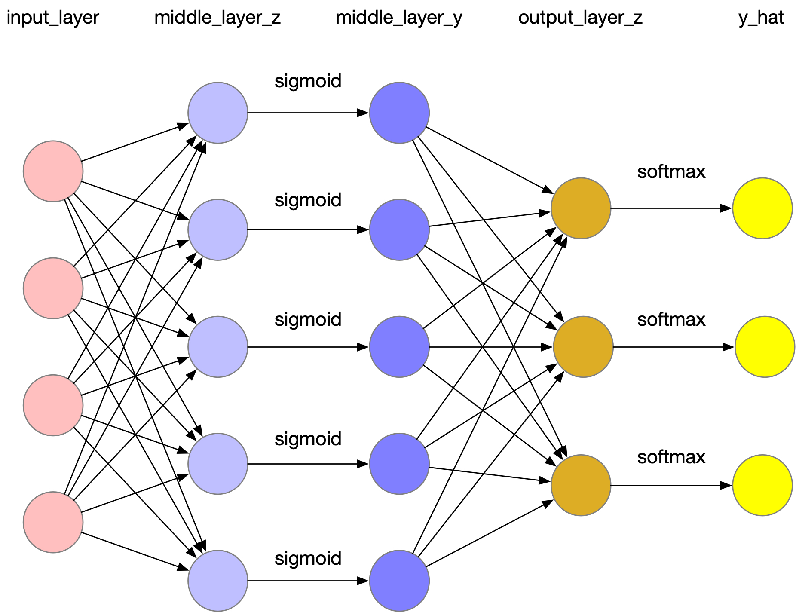

最近又重新喜欢上了用C++写代码的感觉，利用这个周末的空档陆陆续续用它实现了一个浅层的神经网络，也是对整个神经网络的传播与训练方式有了更深刻的印象。

## 数据集

采用UCI的鸢尾花数据集，任务为多分类（三分类）。因此，在损失函数的选择上使用logloss。


## 正向传输

整体的正向传输步骤如下所示：
<br>
<br>


## 反向传播

反向传播有几个重要的点，在代码中也有相应的实现，主要看有反向传播注释的那一段：

```bash
// 反向传播更新参数流程
for epoch in epochs:
    for data in datas:
        1. logloss求梯度
        2. softmax求梯度
        3. output_lay_z对w2与b2求梯度
        4. output_lay_z对middle_layer_y求梯度
        5. sigmoid求梯度
        6. middle_layer_y对w1及b1求梯度
        7. 累加loss2w2, loss2b2, loss2w1, loss2b1
    update(w1, w2, b1, b2)
```